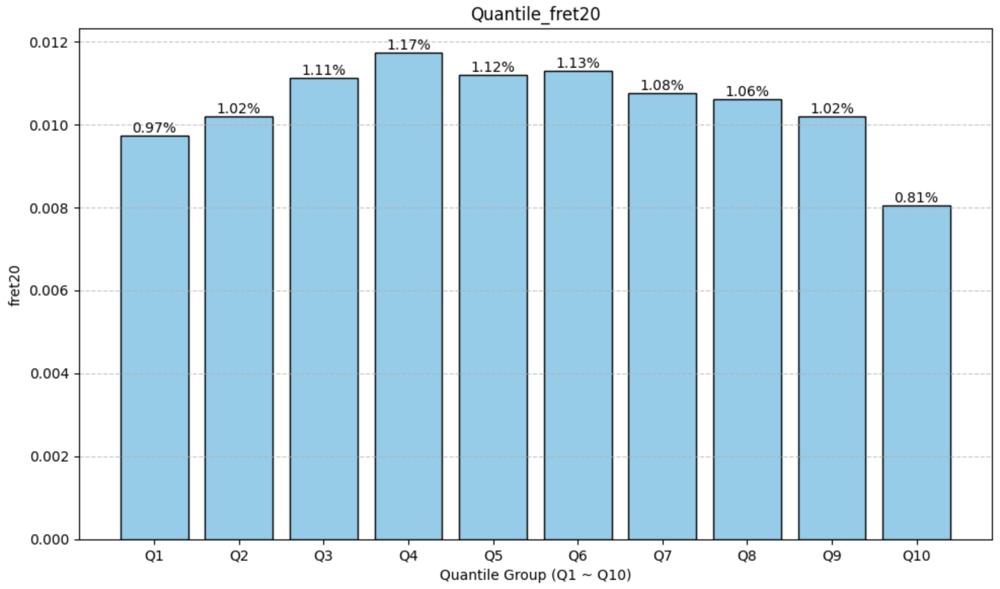
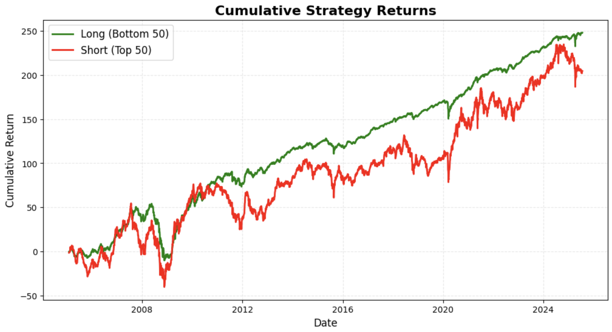
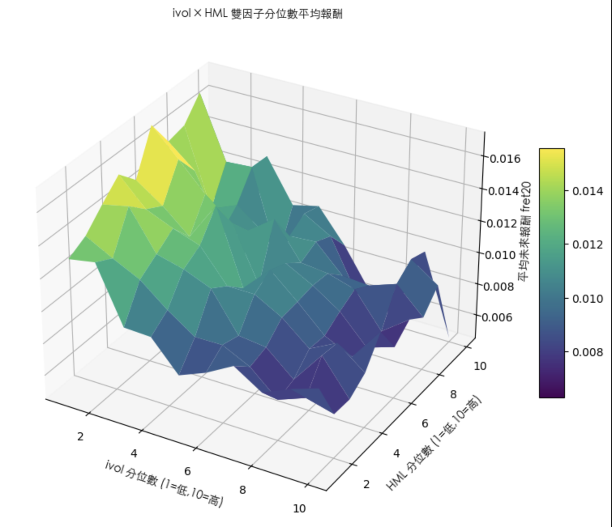
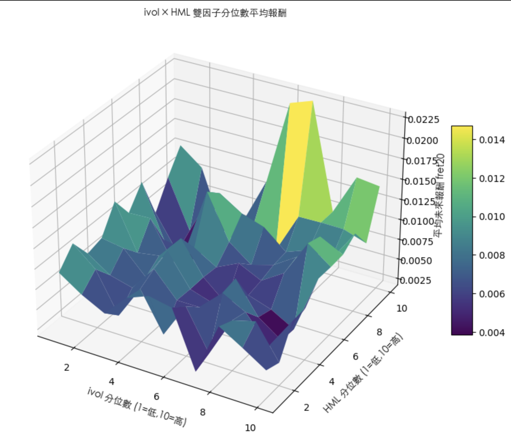

# 特質波動度與套利不對稱性研究 — 台灣市場實證

## 一、基本假設
- **檢定股池**：台灣上市股池  
- **交易頻率**：每月  

---

## 二、特質波動度
由多因子模型可知，股票風險來自於：
1. 因子帶來的系統性風險  
2. 特質波動度（可藉由多元分散消除）

金融理論暗示投資者不應該因承擔特質波動度得到補償，因此其對於股票 **預期收益率應無預測效果**。  

📄 **文獻依據**：  
- Ang et al. (2006), *The Cross-Section of Volatility and Expected Returns*  
  - 指出 **特質波動度與股票未來報酬率呈負相關**

📊 **台灣市場檢定結果**（與 Ang et al. (2006) 一致）：  
### IVOL IC檢定與SPREAD檢定

| 指標       | 數值      |
|------------|-----------|
| IC_MEAN    | -0.070956 |
| IC_IR      | -0.460748 |
| Q10-Q1     | -0.001680 |
### IVOL 十分位數月平均報酬

### IVOL 投資組合報酬

結論：特質波動度與股票未來報酬率呈 **負相關**。

### IVOL 計算公式
特質波動度（Idiosyncratic Volatility, IVOL）通常透過多因子模型計算，公式如下：

$$
r_{i,t} - r_{f,t} = \alpha_i + \beta_{i,1}F_{1,t} + \beta_{i,2}F_{2,t} + \dots + \beta_{i,K}F_{K,t} + \epsilon_{i,t}
$$

其中：
- $r_{i,t}$：股票 $i$ 在時間 $t$ 的報酬率  
- $r_{f,t}$：無風險利率  
- $F_{k,t}$：第 $k$ 個因子的報酬率  
- $\beta_{i,k}$：股票 $i$ 對因子 $k$ 的暴露  
- $\epsilon_{i,t}$：股票 $i$ 的特質報酬  

特質波動度定義為 $\epsilon_{i,t}$ 的標準差：

$$
\text{IVOL}_i = \sigma(\epsilon_{i,t})
$$

---

## 三、套利不對稱性與特質波動率
高特質波動率常被視為 **阻止套利的因素之一**。  

📄 **文獻依據**：  
- Stambaugh et al. (2015)  
  - 從 **套利風險**與**套利不確定性**角度探討特質波動率之謎  

### 套利風險
套利活動常因各種原因受阻。

### 套利不對稱性
1. 投資者傾向積極買入被低估股票  
2. 卻對賣空被高估股票猶豫不決（因噪音交易者可能繼續推升股價，導致斷頭風險）  

---

### Stambaugh et al. (2015) 假說
- 特質波動率（IVOL）越高 → 套利風險越大 → 錯誤定價難以被消除  

| 股票類型     | 解釋 | 與 IVOL 之關係 |
|--------------|------|----------------|
| 被低估股票   | 錯誤定價越嚴重 → 價格相對內在價值越低 → 未來報酬率越高 | **正相關** |
| 被高估股票   | 錯誤定價越嚴重 → 價格相對內在價值越高 → 未來報酬率越低 | **負相關** |

---

### 台灣市場觀察結果
與 Stambaugh et al. (2015) **在美股市場的發現不同**：  
- 不論是被低估或被高估股票，**特質波動度均與未來月收益率呈負相關**  
- 初步判斷：可能因股池內部分標的流動性過低，機構投資人難以進場修正股價  
### ivol × HML 5 分位數平均報酬表格

| ivol\HML | 1        | 2        | 3        | 4        | 5        |
|-----------|----------|----------|----------|----------|----------|
| 1         | 0.013103 | 0.010547 | 0.008844 | 0.008442 | 0.008338 |
| 2         | 0.014966 | 0.012695 | 0.010565 | 0.008537 | 0.008668 |
| 3         | 0.015159 | 0.013149 | 0.010144 | 0.009220 | 0.008177 |
| 4         | 0.014405 | 0.010923 | 0.010797 | 0.009582 | 0.008640 |
| 5         | 0.011870 | 0.010736 | 0.010070 | 0.006210 | 0.007700 |

### 交叉驗證3D圖

---

## 四、延伸分析 — 市值前 150 大

### ivol × HML 5 分位數平均報酬表格(市值前150大)

| ivol\HML | 1        | 2        | 3        | 4        | 5        |
|-----------|----------|----------|----------|----------|----------|
| 1         | 0.009250 | 0.007191 | 0.007282 | 0.005786 | 0.006252 |
| 2         | 0.008297 | 0.007590 | 0.005596 | 0.007315 | 0.006093 |
| 3         | 0.009544 | 0.007459 | 0.006124 | 0.006052 | 0.009154 |
| 4         | 0.008952 | 0.007665 | 0.008328 | 0.008659 | 0.010255 |
| 5         | 0.007549 | 0.004211 | 0.011563 | 0.012525 | 0.013077 |

---
### 交叉驗證3D圖(市值前150大)

